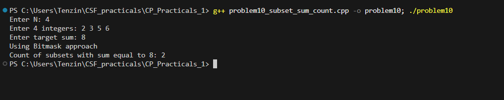

# Problem 10 - Count of Subsets with Sum Equal to Target

## Problem Summary

Given N integers and a target sum, count how many subsets have a sum exactly equal to the target value.

## Algorithm Explanation

Two approaches are provided:

### Approach 1: Bitmask (for N ≤ 20)

1. Generate all 2^N subsets using bitmask technique
2. For each subset, calculate the sum of its elements
3. Count subsets where sum equals target
4. Simple but exponential time complexity

### Approach 2: Dynamic Programming (preferred for larger N)

1. Create a 2D DP table: `dp[i][j]` = count of subsets using first i elements with sum j
2. Base case: `dp[i][0] = 1` (empty subset has sum 0)
3. For each element and each possible sum:
   - Option 1: Don't include current element: `dp[i][j] = dp[i-1][j]`
   - Option 2: Include current element: `dp[i][j] += dp[i-1][j-arr[i-1]]` (if j ≥ arr[i-1])
4. Answer is `dp[n][target]`

The DP approach uses the principle of optimal substructure: the count for n elements is the sum of counts with and without the nth element.

## Time Complexity Analysis

### Bitmask Approach:

- **O(n \* 2^n)** - exponential
- Generating 2^n subsets, each requiring O(n) to compute sum

### Dynamic Programming Approach:

- **O(n \* target)** - polynomial
- Filling a table of size (n+1) × (target+1)
- Much more efficient when target is reasonable

## Space Complexity Analysis

### Bitmask Approach:

- **O(n)** for storing input array

### Dynamic Programming Approach:

- **O(n \* target)** for the DP table
- Can be optimized to O(target) using 1D DP array

## Reflection

This problem taught me the importance of choosing the right algorithm based on constraints. The bitmask approach is straightforward and works for small N, demonstrating the technique clearly. However, the DP approach is far superior for larger inputs, showcasing how dynamic programming can reduce exponential complexity to polynomial by avoiding redundant calculations. I learned that subset sum is a classic DP problem where we build solutions incrementally. The key insight is that each element either contributes to the sum or doesn't, and we can count both possibilities using previous results.

