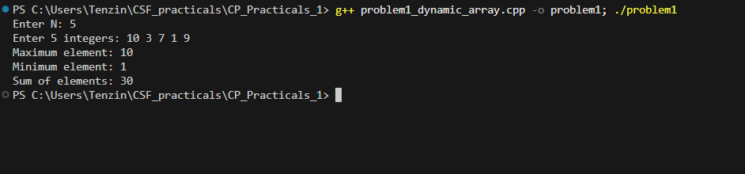

# Problem 1 - Dynamic Array Basics

## Problem Summary
Read N integers into a vector and find the maximum, minimum and sum.
The goal was to use a dynamic container instead of a fixed array and
get familiar with basic STL functions.

## Algorithm Explanation
1. Read N from input, reject if N <= 0
2. Fill a vector of size N with user input
3. Use `max_element()` to find the largest value
4. Use `min_element()` to find the smallest value
5. Sum all elements using `accumulate()`
6. Print the three results

## Time Complexity Analysis
- **Overall: O(n)** — three separate linear passes
- Each STL call (`max_element`, `min_element`, `accumulate`) is O(n)
- No nested loops so complexity stays linear

## Space Complexity Analysis
- **O(n)** — vector holds all N integers
- STL functions work in-place, no extra memory used

## Reflection
I used STL functions instead of manual loops to keep the code clean.
I hadn't used `accumulate()` before this. I could have written a for 
loop for the sum but keeping everything STL felt more consistent. I also 
noticed I'm doing three passes over the vector instead of one, which is 
still O(n) but a single loop would be tighter. I kept it this way since 
it was more readable for me at this stage.

