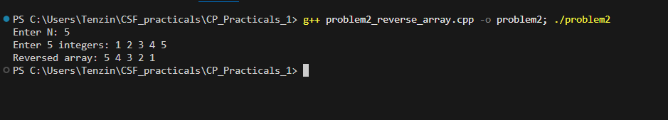

# Problem 2 - Reverse the Array

## Problem Summary
Given N integers stored in a vector, reverse the order and print them
from last to first. Simple problem but good practice for working with
vectors and STL functions.

## Algorithm Explanation
1. Read N from input, reject if N <= 0
2. Fill a vector of size N with user input
3. Call `reverse()` to reverse the vector in place
4. Print all elements using a forward loop

## Time Complexity Analysis
- **Overall: O(n)**
- `reverse()` is O(n) — swaps elements from both ends moving inward
- Printing is O(n)

## Space Complexity Analysis
- **O(n)** — vector holds all N integers
- `reverse()` works in place, no extra memory needed

## Reflection
I used `std::reverse()` here instead of looping backwards manually.
The vector gets flipped in memory first then I just print it forward.
I could have skipped the reverse call and looped from n-1 to 0 instead,
which would avoid modifying the original data — but since I didn't need
the original order after this point, reversing in place was simpler.
It also made the print loop cleaner since it's just a standard
forward loop.

