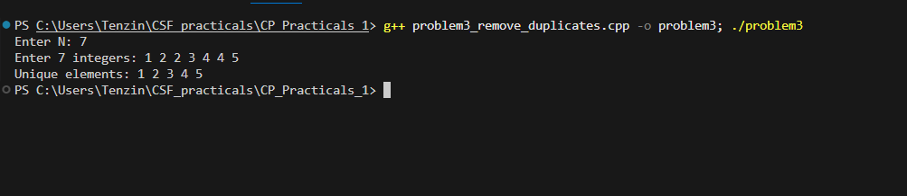

# Problem 3 - Remove Duplicates

## Problem Summary
Given N integers with possible duplicates, print only the unique values
in sorted order. The challenge is removing duplicates cleanly without
using extra data structures.

## Algorithm Explanation
1. Read N integers into a vector
2. Sort the vector using `sort()` — brings duplicates next to each other
3. Use `unique()` to shift duplicate elements to the end, returns
   iterator to new logical end
4. Use `erase()` to actually remove those duplicates from the vector
5. Print remaining unique elements

## Time Complexity Analysis
- **Overall: O(n log n)** — dominated by sorting
- `sort()`: O(n log n)
- `unique()`: O(n) — single pass
- `erase()`: O(n) worst case
- Printing: O(k) where k is number of unique elements

## Space Complexity Analysis
- **O(n)** — vector holds all N integers
- `sort()` uses O(log n) stack space internally
- No extra data structures used

## Reflection
I initially thought about using a set since it handles uniqueness
automatically, but went with the sort + unique + erase approach instead.
One thing that tripped me up at first was that `unique()` doesn't
actually delete anything — it just moves duplicates to the back and
returns an iterator to where the unique range ends. You still need
`erase()` to actually cut them off. Once I understood that, the logic
clicked. Sorting first is what makes it all work since `unique()` only
catches consecutive duplicates.

