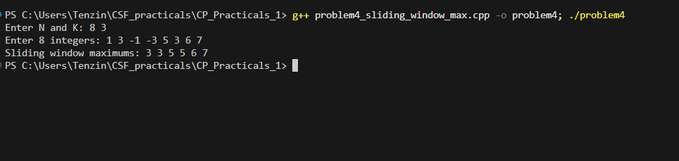

# Problem 4 - Sliding Window Maximum

## Problem Summary
Given an array of N integers and a window size K, find the maximum
in every consecutive window of size K as it slides across the array.
The trick is doing this without rechecking every element in each window.

## Algorithm Explanation
1. Use a deque to store indices of elements in decreasing order of value
2. For each element:
   - Pop from front if that index is outside the current window (i - k)
   - Pop from back while the back element is smaller than current element
   - Push current index to back
   - Once i >= k-1, print arr[dq.front()] as the current window max
3. Front of deque always holds the index of the current maximum

## Time Complexity Analysis
- **Overall: O(n)**
- Each index is pushed and popped from the deque at most once
- No nested loops despite looking like one at first glance

## Space Complexity Analysis
- **O(k)** — deque holds at most k indices at any time
- No result array used, maximums printed directly

## Reflection
I tried brute force first — checking all k elements per window — which
worked but was O(n*k) and felt wasteful. The deque approach took me a
bit to wrap my head around. The key thing I kept getting wrong early on
was the removal condition at the back — you remove elements smaller than
the current one because they can never be the max while a bigger element
is still in the window. Once that made sense the rest followed. Printing
directly instead of storing results also kept the space usage down to
just O(k) for the deque.

