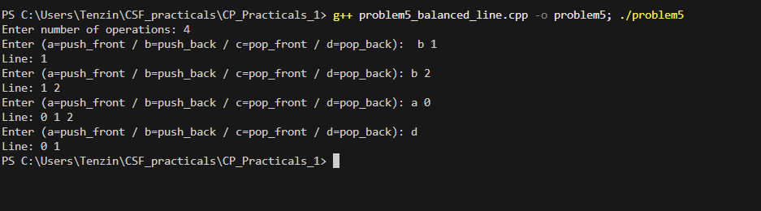

# Problem 5 - Balanced Line Problem

## Problem Summary
Simulate a line where people can join or leave from either end.
After each operation print the current state of the line. The focus
is on using a deque to handle both ends efficiently.

## Algorithm Explanation
1. Create a deque to represent the line
2. Read number of operations
3. For each operation:
   - 'a' → `push_front(x)` — add to front
   - 'b' → `push_back(x)` — add to back
   - 'c' → `pop_front()` — remove from front if not empty
   - 'd' → `pop_back()` — remove from back if not empty
4. After each operation call printLine() to show current state
5. printLine() handles empty deque separately

## Time Complexity Analysis
- **Overall: O(n * m)** where n is operations, m is current deque size
- Each push/pop: O(1)
- Printing after each operation: O(m)

## Space Complexity Analysis
- **O(k)** where k is the maximum deque size at any point
- Grows and shrinks as operations are performed

## Reflection
I had used queues before but always just from one end. This was the
first time I actually needed both ends at once. I initially thought
about using two stacks to simulate this but then realised deque handles
it natively with O(1) operations on both sides. The empty check before
pop operations caught me out once during testing — I forgot it and got
undefined behaviour on an empty deque. Adding that guard in the if
conditions fixed it. The separate printLine() function also kept
main() clean which I liked.

