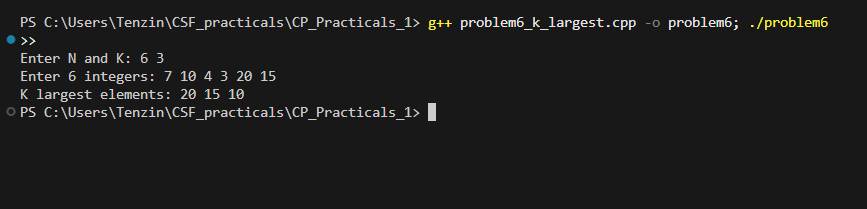

# Problem 6 - K Largest Elements

## Problem Summary
Given N numbers, find and print the K largest elements in descending
order. The goal is to avoid sorting the entire array and instead use
a heap to extract only what's needed.

## Algorithm Explanation
1. Read N and K from input
2. Push all N elements into a max heap using `priority_queue`
3. Pop K times — each pop gives the next largest element
4. Print each popped value directly

## Time Complexity Analysis
- **Overall: O(n log n)**
- Inserting n elements into heap: O(n log n)
- K extractions: O(k log n)
- Since k ≤ n, overall stays O(n log n)

## Space Complexity Analysis
- **O(n)** — heap stores all N elements
- No separate result array, values printed directly during extraction

## Reflection
I knew I needed the top K elements so a max heap felt like the obvious
choice. C++ `priority_queue` is a max heap by default which made setup
straightforward — just push everything in and pop K times. What I found
interesting is that I never had to sort the whole array, the heap just
gives me the largest element on demand each time I pop. I also noted
this could be optimised to O(n log k) using a min heap of size k instead
but for this problem size the max heap approach was simpler and worked
fine.

