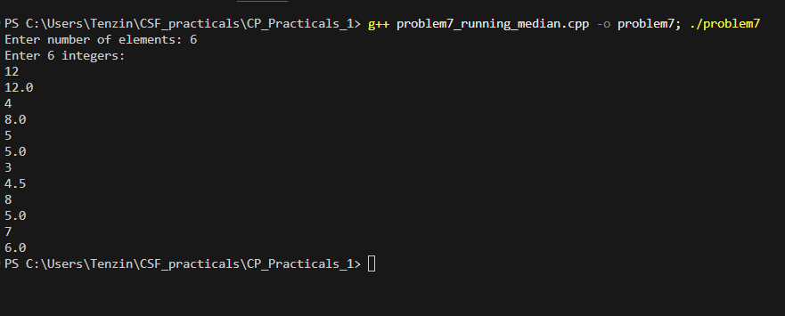

# Problem 7 - Running Median

## Problem Summary
For a stream of integers, print the median after each new number is
added. The median updates dynamically so the challenge is keeping it
efficient without re-sorting everything each time.

## Algorithm Explanation
Uses a MedianFinder class with two heaps:
- `maxHeap` — max heap storing the smaller half of numbers
- `minHeap` — min heap storing the larger half of numbers

For each new number in `addNum()`:
1. If number <= maxHeap top, push to maxHeap, else push to minHeap
2. Rebalance so maxHeap size is equal to or exactly 1 more than minHeap
   - If maxHeap has 2+ more elements, move top to minHeap
   - If minHeap has more elements, move top to maxHeap

In `findMedian()`:
- Equal sizes → average of both tops
- maxHeap larger → return maxHeap top

## Time Complexity Analysis
- **Overall: O(n log n)**
- Each `addNum()` call: O(log n) for heap push/pop
- Each `findMedian()` call: O(1)
- n insertions total: O(n log n)

## Space Complexity Analysis
- **O(n)** — both heaps together store all n elements
- Each heap holds roughly n/2 elements at any time

## Reflection
This was honestly the hardest one for me. I understood what a median
was but keeping it updated after every insertion without resorting was
a different problem. I didn't come up with the two heap idea immediately. I first thought about maintaining a sorted vector and just picking
the middle, but that would be O(n) per insertion just for finding the
right position. The two heap approach was something I had to think
through carefully. The part that took me longest was the balancing
logic — getting the size conditions right so maxHeap always holds the
median when sizes are unequal. Once the class structure clicked it
felt clean though, findMedian() ended up being just two lines.

