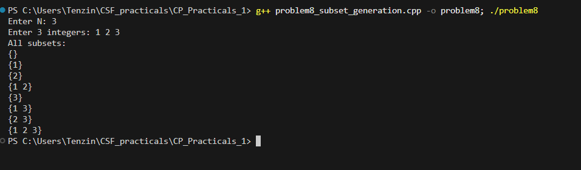

# Problem 8 - Subset Generation

## Problem Summary
Given N numbers, generate and print all 2^N possible subsets including
the empty set. The goal is to use bitmask technique instead of
recursion to enumerate every combination.

## Algorithm Explanation
1. Read N integers into a vector
2. Calculate total subsets as `1 << n` (which is 2^n)
3. Loop mask from 0 to totalSubsets - 1
4. For each mask, loop through all bit positions 0 to n-1
   - Check if bit i is set using `mask & (1 << i)`
   - If set, include arr[i] in current subset
5. Print each subset in {} format

Example for {1, 2, 3}:
- mask=0 (000) → {}
- mask=1 (001) → {1}
- mask=2 (010) → {2}
- mask=3 (011) → {1 2}
- mask=4 (100) → {3} and so on

## Time Complexity Analysis
- **Overall: O(n * 2^n)**
- 2^n subsets total
- Each subset takes O(n) to build by checking all bit positions

## Space Complexity Analysis
- **O(n)** — just the input array
- Subsets are printed on the fly, nothing stored

## Reflection
I had heard of bitmasks before but never actually used them for
something like this. The idea of treating each bit in a number as an
include or exclude flag for an element was new to me. I went through
a few examples by hand first — writing out mask=0,1,2,3 in binary and
checking which elements would be included — before I trusted the logic
enough to code it. What I liked was how clean it ended up being, just
two nested loops and a bitwise AND check. Compared to writing a
recursive solution this felt much more compact once I understood what
the bits were actually representing.

