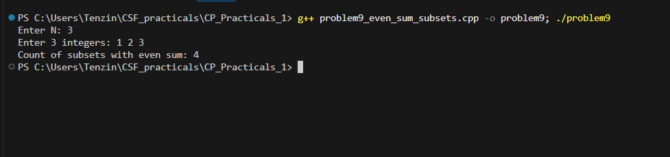

# Problem 9 - Count Subsets with Even Sum

## Problem Summary
Given N numbers, count how many subsets have an even sum. The empty
set counts since its sum is 0 which is even. Uses the same bitmask
approach from Problem 8 with an added condition.

## Algorithm Explanation
1. Read N integers into a vector
2. Calculate total subsets as `1 << n`
3. For each mask from 0 to totalSubsets - 1:
   - Loop through all bit positions 0 to n-1
   - If bit i is set, add arr[i] to current sum
   - After building sum, check if sum % 2 == 0
   - If even, increment evenSumCount
4. Print final count

## Time Complexity Analysis
- **Overall: O(n * 2^n)**
- 2^n subsets, each takes O(n) to sum up
- Same complexity as Problem 8

## Space Complexity Analysis
- **O(n)** — just the input array
- Sum and count are just single variables, O(1) extra space

## Reflection
I reused the bitmask loop from Problem 8 almost exactly and just added
a sum check at the end. The one thing that caught me off guard was
forgetting the empty set — mask=0 gives sum=0 which is even so it
should be counted. Once I remembered that, my output matched. I also
noticed that for most inputs roughly half the subsets end up with even
sums which makes sense mathematically. A smarter approach could solve
this in O(n) using just the count of odd numbers in the array, but the
bitmask way made more sense to show here since the whole practical is
about practicing the technique.

